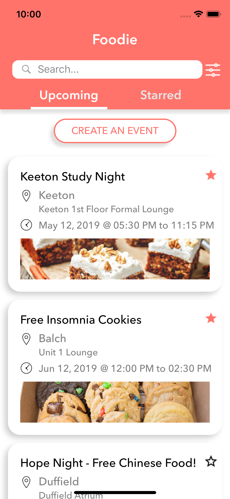
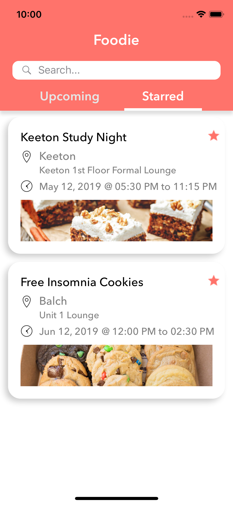
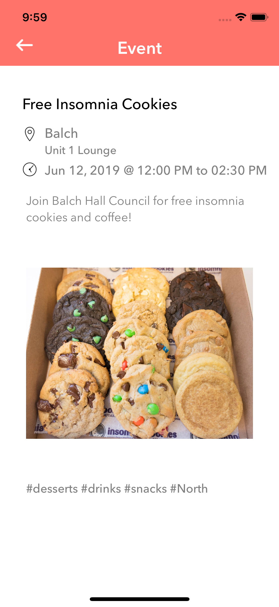
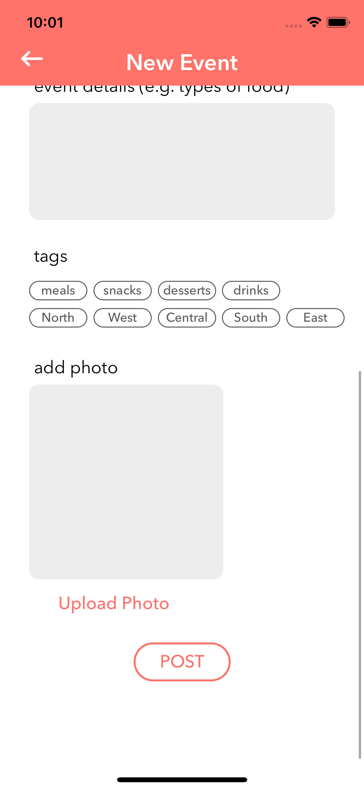
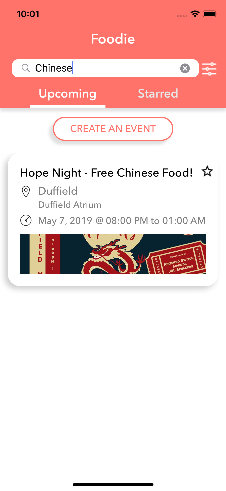
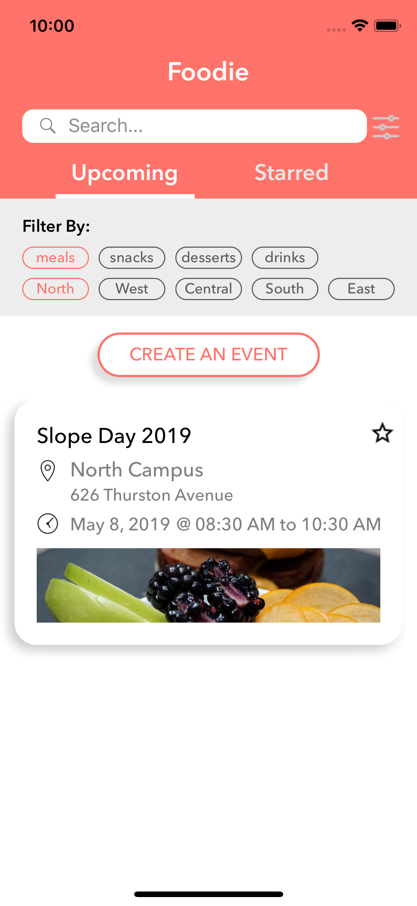

# Foodie
Foodie is an app that allows users to find free food and upload a free food event on Cornell campus. 

Members:  
Haiying Weng: iOS   
Yuxuan Chen: iOS   
Cindy Huang: Design  
Leo Liang: Backend 

# Screenshots 
  
    
    
   

**App Description**  
There are many options to get free food on campus to save money and BRBs, but they are sometimes hard to find or keep up with. Providers of food also want to advertise their events or get rid of food to make clean up easier. This app allows users to upload a free food event or view the lists of free food. Events will have specified location, date, time, tags, and image. The user can filter and search to find their desired events. Filters are based on the type of food and location. There is also a feature for users to save their favorite events. A new event can be created by filling out a form. 

**iOS implementation**  
 - AutoLayout employed using SnapKit
 - UICollectionView used to display all food events
 - UIScrollView to display a form to create an food event
 - UISearchBar to search events 
 - UINavigationController used to move between home screen and screen to create new event and between home screen and event detailView 
 - UIDatePicker for choosing date and time when creating an event
 - UserDefault used to persist events that are starred
 - Storyboard used for the launchscreen
 - Implemented Google SignIn 
 - Integration with API
 
 **Possible implementation for the future**
 - Implement map into location 
 - A tab with all events created by the current user 
 - Allow users to edit amount of food left / wait time 

# Backend Repo 
https://github.com/foxhatleo/Foodies-Backend 

